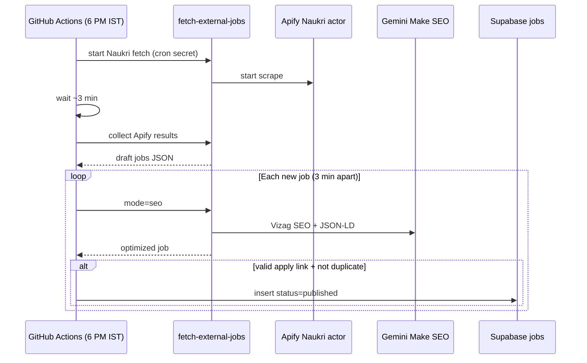

# Automated Naukri fetch → SEO → publish

Daily automation for **Naukri jobs only**: fetch listings at **6:00 PM IST**, run **Make SEO** on each new job with a **3-minute gap**, then **publish** jobs that have a valid apply link and are not already in the database.

## Flow



## What gets published

A job is published only when **all** of these are true:

- Valid **apply link** (or Naukri `source_url` used as fallback, same as admin import)
- **Slug** and **apply link** are not already in `public.jobs`
- SEO step succeeded
- Title, company, category, and job type are present after SEO

Jobs **without** an apply link are skipped (logged, not inserted).

## Setup

### 1. Supabase Edge Function secrets

Already required for manual fetch — see `docs/supabase-setup.md`:

- `APIFY_API_TOKEN_NAUKRI` (or `APIFY_API_TOKEN`)
- `GEMINI_API_KEY` or `GEMINI_API_KEY_SEO`
- `FETCH_JOBS_CRON_SECRET` — long random string for headless auth

### 2. GitHub repository secrets

Add these under **Settings → Secrets and variables → Actions**:

| Secret | Value |
|--------|--------|
| `SUPABASE_URL` | Project URL |
| `SUPABASE_ANON_KEY` | Anon/public key |
| `SUPABASE_SERVICE_ROLE_KEY` | Service role key (server-only; never in frontend) |
| `FETCH_JOBS_CRON_SECRET` | Same value as in Supabase Edge Function secrets |

### 3. Enable the workflow

The workflow file is `.github/workflows/auto-naukri-daily.yml`.

- **Schedule:** `30 12 * * *` UTC = **6:00 PM IST** every day
- **Manual run:** Actions → *Auto Naukri daily pipeline* → *Run workflow*

## Local test

```bash
export SUPABASE_URL=...
export SUPABASE_ANON_KEY=...
export SUPABASE_SERVICE_ROLE_KEY=...
export FETCH_JOBS_CRON_SECRET=...

# Dry run — fetch + SEO, no DB writes
AUTO_NAUKRI_DRY_RUN=true node scripts/auto-naukri-pipeline.mjs

# Full run
node scripts/auto-naukri-pipeline.mjs
```

Or: `npm run auto:naukri`

## Tunables (env)

| Variable | Default | Purpose |
|----------|---------|---------|
| `AUTO_NAUKRI_SEO_GAP_MS` | `180000` | Wait between SEO calls (3 min) |
| `AUTO_NAUKRI_COLLECT_WAIT_MS` | `180000` | Wait after Apify start before first collect |
| `AUTO_NAUKRI_COLLECT_MAX_ATTEMPTS` | `24` | Max collect retries |
| `AUTO_NAUKRI_MAX_JOBS` | `30` | Max jobs processed per run |
| `AUTO_NAUKRI_SEO_TIMEOUT_MS` | `130000` | Per-job SEO HTTP timeout |
| `AUTO_NAUKRI_DRY_RUN` | `false` | Log only, no DB inserts |

## Notes

- This does **not** replace the admin review UI — it automates the same steps an admin would take on `/admin/fetch` for Naukri.
- Long runs are expected: 10 jobs ≈ 30 minutes of SEO gaps plus fetch/SEO latency. GitHub Actions timeout is set to **180 minutes**.
- After publish, the next site build will refresh `sitemap.xml` (generated at build time).
