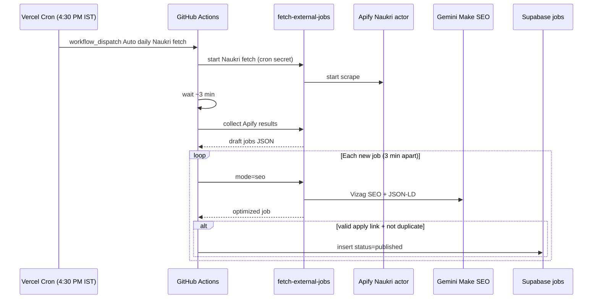

# Automated Naukri fetch → SEO → publish

## Supported sources

| Channel | Admin UI | CLI | Daily cron (IST) |
|---------|----------|-----|------------------|
| **Naukri** | Start automation on Naukri card | `npm run auto:naukri` | **4:30 PM** |
| **LinkedIn Posts** | Start automation on LinkedIn Posts card (uses preset) | `npm run auto:linkedin-posts` | **6:00 PM** (general preset) |
| **LinkedIn Jobs** | Start automation on LinkedIn Jobs card | `npm run auto:linkedin-jobs` | **9:00 PM** |

Naukri runs in `.github/workflows/auto-naukri-fetch.yml`. LinkedIn, the daily blog, and the YouTube Short share `.github/workflows/auto-naukri-daily.yml`. GitHub’s own `schedule` event was starting Naukri 4+ hours late, so Naukri is now kicked off at **4:30 PM IST** by **Vercel Cron** (and optionally Supabase `pg_cron`) using `workflow_dispatch`. All channels use the same fetch → SEO (3 min gap) → publish → report → email flow.

## Flow



## What gets published

A job is published only when **all** of these are true:

- Valid **apply link** (or Naukri `source_url` used as fallback, same as admin import)
- **Slug** and **apply link** are not already in `public.jobs`
- SEO step succeeded
- Title, company, category, and job type are present after SEO
- **Real employer name** — not `Employer name shared during interview` or other placeholders
- **Specific role title** — not aggregate SEO titles like `… Jobs in Vizag, Visakhapatnam` or keyword-stuffed listings
- **Real location** — not comma-separated hashtag blobs (e.g. `ArtificialIntelligence, DataCenters, …`)

Jobs **without** an apply link are skipped (logged, not inserted).

## Setup

### 1. Supabase Edge Function secrets

Already required for manual fetch — see `docs/supabase-setup.md`:

- `APIFY_API_TOKEN_NAUKRI` (or `APIFY_API_TOKEN`)
- `GEMINI_API_KEY` or `GEMINI_API_KEY_SEO`
- `FETCH_JOBS_CRON_SECRET` — long random string for headless auth
- `GITHUB_DISPATCH_TOKEN` — fine-grained PAT with **Actions: Read and write** (same secret used by `trigger-youtube-short`)

### 2. GitHub repository secrets

Add these under **Settings → Secrets and variables → Actions**:

| Secret | Value |
|--------|--------|
| `SUPABASE_URL` | Project URL |
| `SUPABASE_ANON_KEY` | Anon/public key |
| `SUPABASE_SERVICE_ROLE_KEY` | Service role key (server-only; never in frontend) |
| `FETCH_JOBS_CRON_SECRET` | Same value as in Supabase Edge Function secrets |

### 3. Enable the 4:30 PM IST Naukri trigger

GitHub `schedule` is **not** used for Naukri. An external ping starts the workflow near 4:30 PM IST (`11:00` UTC).

**A. Vercel Cron (automatic after deploy)** — `vercel.json` calls `GET /api/cron/dispatch-naukri` daily at `0 11 * * *`.

Add these **Vercel** environment variables (Production):

| Variable | Value |
|----------|--------|
| `CRON_SECRET` | Long random string. Vercel sends `Authorization: Bearer <CRON_SECRET>` on cron GETs. |
| `FETCH_JOBS_CRON_SECRET` | Same value as GitHub Actions / Supabase (used to call the Edge Function if `GITHUB_DISPATCH_TOKEN` is not on Vercel). |
| `GITHUB_DISPATCH_TOKEN` | Optional on Vercel. Fine-grained PAT with **Actions: Read and write**. If set, the API talks to GitHub directly. |
| `SUPABASE_URL` or `VITE_SUPABASE_URL` | Needed when `GITHUB_DISPATCH_TOKEN` is not on Vercel. |

Also add **`GITHUB_DISPATCH_TOKEN`** to **Supabase Edge Function secrets** if it is not already there for YouTube Short dispatch.

The dispatcher skips a new run if one is already queued/in progress, was triggered in the last 20 minutes, or succeeded in the last 12 hours.

**B. Supabase `pg_cron` (optional, very punctual)** — after deploying `dispatch-naukri-workflow`, run [`supabase/cron/schedule-naukri-dispatch.sql`](../supabase/cron/schedule-naukri-dispatch.sql) in the SQL editor. Create vault secrets `project_url` and `fetch_jobs_cron_secret` first. Skip this if Vercel Cron is enough.

**C. cron-job.org / EasyCron backup**

```bash
curl -sS -X POST "$SUPABASE_URL/functions/v1/dispatch-naukri-workflow" \
  -H "apikey: $SUPABASE_ANON_KEY" \
  -H "Authorization: Bearer $FETCH_JOBS_CRON_SECRET" \
  -H "x-fetch-jobs-cron-secret: $FETCH_JOBS_CRON_SECRET" \
  -H "Content-Type: application/json" \
  -d '{"source":"cron-job.org"}'
```

Schedule: every day at **11:00 UTC**.

- **LinkedIn / blog / Shorts** (`.github/workflows/auto-naukri-daily.yml`) still use GitHub `schedule`:
  - LinkedIn Posts: `30 12 * * *` UTC = **6:00 PM IST**
  - LinkedIn Jobs: `30 15 * * *` UTC = **9:00 PM IST**
- **Manual run:** Actions → *Auto daily Naukri fetch* → *Run workflow*

## Local test

### Admin UI (manual)

1. Sign in at `/admin/login`
2. Open **Fetch external jobs** (`/admin/fetch`)
3. On the **Naukri** card, click **Start automation →**
4. Keep the tab open — progress shows on screen (Apify wait, SEO gaps, publish count)

**Fetch only (manual review)** still uses the separate button on the same card.

### CLI

```bash
export SUPABASE_URL=...
export SUPABASE_ANON_KEY=...
export SUPABASE_SERVICE_ROLE_KEY=...
export FETCH_JOBS_CRON_SECRET=...

# Dry run — fetch + SEO, no DB writes
AUTO_NAUKRI_DRY_RUN=true node scripts/auto-naukri-pipeline.mjs

# Full run
node scripts/auto-naukri-pipeline.mjs
```

Or: `npm run auto:naukri`

## Automation report

After each run, a **per-job report** shows what happened to every fetched listing.

### Admin UI

On `/admin/fetch`, see **Automation report** below the notice banner.

**Two ways to keep the report:**

1. **Email summary** — sent automatically to `kkumardadi@gmail.com` after each run (or click **Email summary** to resend)
2. **Download** — **Download JSON** (full data) or **Download CSV** (spreadsheet-friendly)

The report persists in browser storage until **Clear report**.

| Status | Meaning |
|--------|---------|
| **Published** | Inserted into `public.jobs` |
| **Skipped (before SEO)** | Already in DB, missing apply link, or missing title/company |
| **Duplicate in batch** | Same job twice in one fetch |
| **SEO failed** | Gemini / Edge Function error |
| **Skipped (after SEO)** | Failed dedup after SEO rewrite |
| **Publish failed** | Database insert error |

### CLI

Writes `naukri-automation-report-YYYY-MM-DD-HH-mm-ss.json` in the working directory.

### Why ~70 Apify items but only ~5 published?

Common and usually expected — check the automation report / GitHub Actions log for exact reasons:

1. **Apify raw scrape pool is larger than mapped jobs** — experience-sort asks Apify for ~3× candidates (e.g. ~75) then keeps ~12–25 Vizag-filtered fresher-first results.
2. **Skipped before SEO** — apply link / slug already in `jobs`, missing apply link, or quality gate (placeholder company / keyword title).
3. **Skipped after SEO** — Make SEO rewrote title/company into keyword-hub phrasing; quality gates then block publish (pipeline now restores the scraped title/company when the rewrite is bad).
4. **SEO / publish failures** — Gemini timeouts, 429s, or DB insert errors.

There is **no hard daily publish cap of 5**. Low publish counts mean filters + dedupe, not a quota.

## Email summary

After each automation run, a summary email is sent to **`kkumardadi@gmail.com`** (override with `AUTOMATION_SUMMARY_EMAIL`).

### Setup (one-time)

1. Create a free account at [resend.com](https://resend.com)
2. Create an API key
3. Add Supabase Edge Function secrets:

| Secret | Value |
|--------|--------|
| `RESEND_API_KEY` | `re_...` from Resend dashboard |
| `RESEND_FROM_EMAIL` | Optional. Default `Vizag Jobs <onboarding@resend.dev>` (Resend test sender — only works for verified/test use). For production, verify `jobsinvizag.in` in Resend and use e.g. `Vizag Jobs <noreply@jobsinvizag.in>` |
| `AUTOMATION_SUMMARY_EMAIL` | Optional. Default `kkumardadi@gmail.com` |
| `SITE_URL` | Optional. Default `https://jobsinvizag.in` (link in email) |

4. Deploy the new function:

```bash
supabase functions deploy send-automation-summary --no-verify-jwt
```

### When email is sent

- **Admin UI** — after **Start automation** finishes (success or partial failure)
- **CLI / GitHub Actions** — after `npm run auto:naukri` (disable with `AUTO_NAUKRI_SEND_EMAIL=false`)

Email includes stats + a table of every job with status and reason.

## Tunables (env)

| Variable | Default | Purpose |
|----------|---------|---------|
| `AUTO_NAUKRI_SEO_GAP_MS` | `180000` | Wait between SEO calls (3 min) |
| `AUTO_NAUKRI_COLLECT_WAIT_MS` | `180000` | Wait after Apify start before first collect |
| `AUTO_NAUKRI_COLLECT_MAX_ATTEMPTS` | `24` | Max collect retries |
| `AUTO_NAUKRI_MAX_JOBS` | `30` | Max jobs processed per run |
| `AUTO_NAUKRI_SEO_TIMEOUT_MS` | `130000` | Per-job SEO HTTP timeout |
| `AUTO_NAUKRI_DRY_RUN` | `false` | Log only, no DB inserts |

## Notes

- This does **not** replace the admin review UI — it automates the same steps an admin would take on `/admin/fetch` for Naukri.
- Long runs are expected: 10 jobs ≈ 30 minutes of SEO gaps plus fetch/SEO latency. GitHub Actions timeout is set to **180 minutes**.
- After publish, the next site build will refresh `sitemap.xml` (generated at build time).

## Daily blog (AdSense-quality market article)

After the evening job pipelines finish, a **separate cron at 10:15 PM IST** runs `npm run auto:daily-blog`.

### What it does

1. Loads all jobs **published today (IST)** from Supabase
2. Fetches optional **live web context** via Firecrawl (Vizag / AP hiring news)
3. Calls Gemini with a **rotating editorial angle** (market pulse, sector spotlight, fresher lens, etc.)
4. Writes an original **900–1400 word** Markdown article to `blog_posts`
5. Publishes automatically (or saves as draft if configured)

The prompt is tuned for **Google AdSense approval**: analysis-first, limited raw job lists, internal links, honest aggregator disclaimer.

### Deploy (one-time)

```bash
supabase functions deploy generate-daily-blog --no-verify-jwt
```

Uses existing secrets: `GEMINI_API_KEY`, `FETCH_JOBS_CRON_SECRET`, `FIRECRAWL_API_KEY` (optional but recommended for live market context).

### Manual run

```bash
npm run auto:daily-blog
```

### Admin panel

Open **Admin → Blog posts** (`/admin/blog`). Use **Generate market blog** to run Gemini manually with options:

- Article date (IST)
- Minimum jobs required
- Publish immediately vs save as draft
- Skip if today's article already exists

### Tunables

| Variable | Default | Purpose |
|----------|---------|---------|
| `AUTO_DAILY_BLOG_PUBLISH` | `true` | Publish immediately (`false` = draft) |
| `AUTO_DAILY_BLOG_MIN_JOBS` | `1` | Skip if fewer jobs published today |
| `AUTO_DAILY_BLOG_SKIP_IF_EXISTS` | `true` | Skip if slug for today's angle already exists |
| `GEMINI_API_KEY_BLOG` | — | Optional dedicated Gemini key for blog generation |
| `GEMINI_BLOG_MODEL` | `gemini-2.5-flash` | Model override |
| `FIRECRAWL_API_KEY_BLOG` | — | Optional dedicated Firecrawl key for web context |
