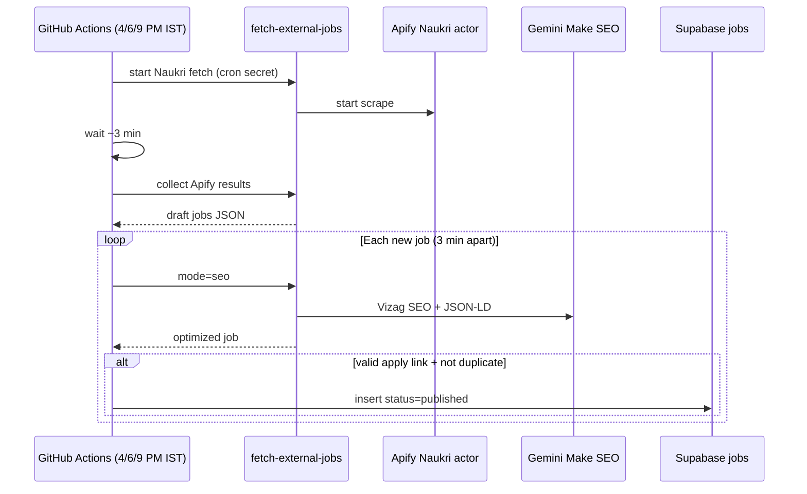

# Automated Naukri fetch → SEO → publish

## Supported sources

| Channel | Admin UI | CLI | Daily cron (IST) |
|---------|----------|-----|------------------|
| **Naukri** | Start automation on Naukri card | `npm run auto:naukri` | **4:00 PM** |
| **LinkedIn Posts** | Start automation on LinkedIn Posts card (uses preset) | `npm run auto:linkedin-posts` | **6:00 PM** (general preset) |
| **LinkedIn Jobs** | Start automation on LinkedIn Jobs card | `npm run auto:linkedin-jobs` | **9:00 PM** |

Each channel runs on its own schedule via GitHub Actions (`.github/workflows/auto-naukri-daily.yml`). All use the same fetch → SEO (3 min gap) → publish → report → email flow.

## Flow



## What gets published

A job is published only when **all** of these are true:

- Valid **apply link** (or Naukri `source_url` used as fallback, same as admin import)
- **Slug** and **apply link** are not already in `public.jobs`
- SEO step succeeded
- Title, company, category, and job type are present after SEO

Jobs **without** an apply link are skipped (logged, not inserted).

## Setup

### 1. Supabase Edge Function secrets

Already required for manual fetch — see `docs/supabase-setup.md`:

- `APIFY_API_TOKEN_NAUKRI` (or `APIFY_API_TOKEN`)
- `GEMINI_API_KEY` or `GEMINI_API_KEY_SEO`
- `FETCH_JOBS_CRON_SECRET` — long random string for headless auth

### 2. GitHub repository secrets

Add these under **Settings → Secrets and variables → Actions**:

| Secret | Value |
|--------|--------|
| `SUPABASE_URL` | Project URL |
| `SUPABASE_ANON_KEY` | Anon/public key |
| `SUPABASE_SERVICE_ROLE_KEY` | Service role key (server-only; never in frontend) |
| `FETCH_JOBS_CRON_SECRET` | Same value as in Supabase Edge Function secrets |

### 3. Enable the workflow

The workflow file is `.github/workflows/auto-naukri-daily.yml`.

- **Schedule (IST):**
  - Naukri: `30 10 * * *` UTC = **4:00 PM IST**
  - LinkedIn Posts: `30 12 * * *` UTC = **6:00 PM IST**
  - LinkedIn Jobs: `30 15 * * *` UTC = **9:00 PM IST**
- **Manual run:** Actions → *Auto daily job pipelines* → *Run workflow* (runs all three channels)

## Local test

### Admin UI (manual)

1. Sign in at `/admin/login`
2. Open **Fetch external jobs** (`/admin/fetch`)
3. On the **Naukri** card, click **Start automation →**
4. Keep the tab open — progress shows on screen (Apify wait, SEO gaps, publish count)

**Fetch only (manual review)** still uses the separate button on the same card.

### CLI

```bash
export SUPABASE_URL=...
export SUPABASE_ANON_KEY=...
export SUPABASE_SERVICE_ROLE_KEY=...
export FETCH_JOBS_CRON_SECRET=...

# Dry run — fetch + SEO, no DB writes
AUTO_NAUKRI_DRY_RUN=true node scripts/auto-naukri-pipeline.mjs

# Full run
node scripts/auto-naukri-pipeline.mjs
```

Or: `npm run auto:naukri`

## Automation report

After each run, a **per-job report** shows what happened to every fetched listing.

### Admin UI

On `/admin/fetch`, see **Automation report** below the notice banner.

**Two ways to keep the report:**

1. **Email summary** — sent automatically to `kkumardadi@gmail.com` after each run (or click **Email summary** to resend)
2. **Download** — **Download JSON** (full data) or **Download CSV** (spreadsheet-friendly)

The report persists in browser storage until **Clear report**.

| Status | Meaning |
|--------|---------|
| **Published** | Inserted into `public.jobs` |
| **Skipped (before SEO)** | Already in DB, missing apply link, or missing title/company |
| **Duplicate in batch** | Same job twice in one fetch |
| **SEO failed** | Gemini / Edge Function error |
| **Skipped (after SEO)** | Failed dedup after SEO rewrite |
| **Publish failed** | Database insert error |

### CLI

Writes `naukri-automation-report-YYYY-MM-DD-HH-mm-ss.json` in the working directory.

### Why 23 fetched but only 5 published?

This is normal on a site that already has jobs:

- **Fetched (23)** = everything Apify returned today
- **Skipped before SEO (~18)** = already in your database or no apply link
- **Queued (~5)** = truly new jobs → SEO → publish

Check the report table for the exact reason on each row.

## Email summary

After each automation run, a summary email is sent to **`kkumardadi@gmail.com`** (override with `AUTOMATION_SUMMARY_EMAIL`).

### Setup (one-time)

1. Create a free account at [resend.com](https://resend.com)
2. Create an API key
3. Add Supabase Edge Function secrets:

| Secret | Value |
|--------|--------|
| `RESEND_API_KEY` | `re_...` from Resend dashboard |
| `RESEND_FROM_EMAIL` | Optional. Default `Vizag Jobs <onboarding@resend.dev>` (Resend test sender — only works for verified/test use). For production, verify `jobsinvizag.in` in Resend and use e.g. `Vizag Jobs <noreply@jobsinvizag.in>` |
| `AUTOMATION_SUMMARY_EMAIL` | Optional. Default `kkumardadi@gmail.com` |
| `SITE_URL` | Optional. Default `https://jobsinvizag.in` (link in email) |

4. Deploy the new function:

```bash
supabase functions deploy send-automation-summary --no-verify-jwt
```

### When email is sent

- **Admin UI** — after **Start automation** finishes (success or partial failure)
- **CLI / GitHub Actions** — after `npm run auto:naukri` (disable with `AUTO_NAUKRI_SEND_EMAIL=false`)

Email includes stats + a table of every job with status and reason.

## Tunables (env)

| Variable | Default | Purpose |
|----------|---------|---------|
| `AUTO_NAUKRI_SEO_GAP_MS` | `180000` | Wait between SEO calls (3 min) |
| `AUTO_NAUKRI_COLLECT_WAIT_MS` | `180000` | Wait after Apify start before first collect |
| `AUTO_NAUKRI_COLLECT_MAX_ATTEMPTS` | `24` | Max collect retries |
| `AUTO_NAUKRI_MAX_JOBS` | `30` | Max jobs processed per run |
| `AUTO_NAUKRI_SEO_TIMEOUT_MS` | `130000` | Per-job SEO HTTP timeout |
| `AUTO_NAUKRI_DRY_RUN` | `false` | Log only, no DB inserts |

## Notes

- This does **not** replace the admin review UI — it automates the same steps an admin would take on `/admin/fetch` for Naukri.
- Long runs are expected: 10 jobs ≈ 30 minutes of SEO gaps plus fetch/SEO latency. GitHub Actions timeout is set to **180 minutes**.
- After publish, the next site build will refresh `sitemap.xml` (generated at build time).
