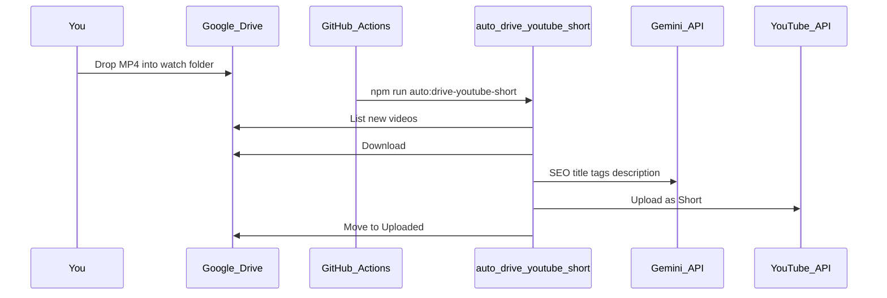

# Drive → YouTube Shorts auto-upload

Drop a vertical video into a Google Drive folder. Every **2 hours**, GitHub Actions downloads new files, generates SEO title / description / tags with **Gemini**, uploads each as a **YouTube Short**, then moves the file into an `Uploaded/` subfolder.

## Flow



## One-time setup

### 1. Google Cloud APIs

1. Open [Google Cloud Console](https://console.cloud.google.com/)
2. Select the same project used for YouTube OAuth
3. Enable **YouTube Data API v3** (if not already)
4. Enable **Google Drive API**

### 2. Drive watch folder

1. Create a folder in Google Drive, e.g. `YouTube Shorts Inbox`
2. Open the folder — the URL looks like:
   `https://drive.google.com/drive/folders/XXXXXXXXXXXXXXXXXXXX`
3. Copy the folder ID (`XXXXXXXXXXXXXXXXXXXX`)

### 3. Two separate OAuth logins (important for Brand Accounts)

YouTube Brand Accounts (like Student Needs) **cannot use Google Drive**. Use two tokens:

1. **YouTube** (Brand Account / channel):
   ```bash
   npm run youtube:oauth-setup
   ```
2. **Drive** (normal Gmail that owns the folder, e.g. `todayjobalerts`):
   ```bash
   npm run drive:oauth-setup
   ```

### 4. Local env (`.env.local`)

```env
YOUTUBE_CLIENT_ID=...
YOUTUBE_CLIENT_SECRET=...
YOUTUBE_REFRESH_TOKEN=...          # Brand Account / channel token
GOOGLE_DRIVE_REFRESH_TOKEN=...     # normal Gmail Drive token
GOOGLE_DRIVE_WATCH_FOLDER_ID=your-folder-id
GEMINI_API_KEY=your-gemini-key
# AUTO_DRIVE_YT_PRIVACY=public
# AUTO_DRIVE_YT_MAX_FILES=3
```

### 5. GitHub Actions secrets

| Secret | Value |
|--------|--------|
| `YOUTUBE_CLIENT_ID` | OAuth client ID |
| `YOUTUBE_CLIENT_SECRET` | OAuth client secret |
| `YOUTUBE_REFRESH_TOKEN` | YouTube channel / Brand Account token |
| `GOOGLE_DRIVE_REFRESH_TOKEN` | Normal Gmail Drive token |
| `GOOGLE_DRIVE_WATCH_FOLDER_ID` | Watch folder ID |
| `GEMINI_API_KEY` | Gemini API key |

Optional helper (after `gh auth login`):

```powershell
.\scripts\set-github-youtube-secrets.ps1
# Then also:
# echo YOUR_FOLDER_ID | gh secret set GOOGLE_DRIVE_WATCH_FOLDER_ID
```

## Usage

Dry run (download + SEO only, no upload / move):

```bash
AUTO_DRIVE_YT_DRY_RUN=true npm run auto:drive-youtube-short
```

Upload for real:

```bash
npm run auto:drive-youtube-short
```

Manual GitHub run: **Actions → Drive → YouTube Shorts → Run workflow**.

## Behavior

| Setting | Default |
|---------|---------|
| Schedule | Every 2 hours |
| Max files per run | 3 (oldest first) |
| Formats | `.mp4`, `.mov`, `.webm` (+ common video MIME types) |
| Privacy | `public` |
| After success | Move file to `Uploaded/` inside the watch folder |
| Dedup | Description marker `drive-file:{driveFileId}` |

Gemini produces:

- **Title** — SEO-oriented, includes `#Shorts` (≤100 chars)
- **Description** — CTA + hashtags + `https://jobsinvizag.in` + Drive file marker
- **Tags** — 8–15 keywords

If Gemini fails, filename-based fallback metadata is used so the upload still proceeds.

## Tips

- Upload **vertical** Shorts-ready videos (9:16). This pipeline does not re-encode or crop.
- Keep the OAuth app in **Production** in Google Cloud; Testing-mode refresh tokens often expire after 7 days.
- Re-run `npm run drive:oauth-setup` (normal Gmail) for Drive permission/token errors; use `npm run youtube:oauth-setup` only for channel/Brand Account upload errors.

## Related

- Daily auto-generated job Shorts: [youtube-shorts-automation.md](./youtube-shorts-automation.md)
