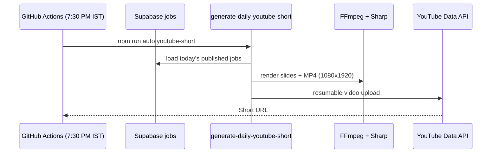

# Daily YouTube Shorts automation

Automatically creates a vertical **YouTube Short** from today's published Vizag jobs and uploads it to your channel.

## Flow



## What gets posted

Default renderer: **Pollinations AI + text overlay** (`AUTO_YOUTUBE_SHORT_RENDERER=pollinations`).

1. **Pollinations** generates a free AI background (Vizag city / workplace themed, no text)
2. **Sharp overlay** adds exact job details (title, company, salary) on top
3. FFmpeg stitches images into an MP4 Short (~15–20 seconds)
4. Uploads to your YouTube channel

Other renderers:
- `slides` — improved gradient cards (100% free, no API)
- `gemini` — full AI images via `gemini-2.5-flash-image` (needs billing)

- **Title** — `Vizag Jobs Today - 5 Jul 2026 #Shorts`
- **Voice-over** — off by default (enable with `AUTO_YOUTUBE_SHORT_VOICE=true`)
- **Description** — job list + site links + hashtags

Skipped when:

- Fewer than `AUTO_YOUTUBE_SHORT_MIN_JOBS` jobs published today (default `1`)
- A Short with today's marker already exists on the channel

## One-time setup

### 1. Google Cloud + YouTube API

1. Open [Google Cloud Console](https://console.cloud.google.com/)
2. Create or select a project
3. Enable **YouTube Data API v3**
4. **APIs & Services → Credentials → Create credentials → OAuth client ID**
5. Application type: **Web application**
6. Authorized redirect URI: `http://localhost:8765/oauth2callback`
7. Copy **Client ID** and **Client secret**

### 2. OAuth refresh token (local, one time)

Add to `.env.local`:

```env
YOUTUBE_CLIENT_ID=your-client-id.apps.googleusercontent.com
YOUTUBE_CLIENT_SECRET=your-client-secret
```

Run:

```bash
npm run youtube:oauth-setup
```

Sign in with the **Google account that owns your YouTube channel**. Copy the printed `YOUTUBE_REFRESH_TOKEN`.

### 3. GitHub Actions secrets

Add under **Settings → Secrets and variables → Actions**:

| Secret | Value |
|--------|--------|
| `YOUTUBE_CLIENT_ID` | From Google Cloud |
| `YOUTUBE_CLIENT_SECRET` | From Google Cloud |
| `YOUTUBE_REFRESH_TOKEN` | From oauth setup |
| `GEMINI_API_KEY` | Same Gemini key used for SEO/blog (Nano Banana image generation) |
| `SUPABASE_URL` | Already used by job pipelines |
| `SUPABASE_ANON_KEY` | Already used |
| `SUPABASE_SERVICE_ROLE_KEY` | Already used |
| `FETCH_JOBS_CRON_SECRET` | Already used |

### 4. FFmpeg (local runs only)

GitHub Actions installs FFmpeg automatically. For local testing, install FFmpeg and ensure `ffmpeg` is in your PATH:

- Windows: `winget install Gyan.FFmpeg` or [ffmpeg.org](https://ffmpeg.org/download.html)
- macOS: `brew install ffmpeg`

## Local test

Dry run (build video only, no upload):

```bash
AUTO_YOUTUBE_SHORT_DRY_RUN=true npm run auto:youtube-short
```

Full upload:

```bash
npm run auto:youtube-short
```

Private test upload:

```bash
AUTO_YOUTUBE_SHORT_PRIVACY=private npm run auto:youtube-short
```

## Schedule

Runs daily at **7:30 PM IST** via `.github/workflows/auto-naukri-daily.yml`.

Manual run: **Actions → Auto daily job pipelines → Run workflow**.

## Tunables

| Variable | Default | Purpose |
|----------|---------|---------|
| `AUTO_YOUTUBE_SHORT_RENDERER` | `pollinations` | `pollinations`, `slides`, or `gemini` |
| `AUTO_YOUTUBE_SHORT_PUBLISH` | `true` | Upload as public (`false` still uploads private if not dry run) |
| `AUTO_YOUTUBE_SHORT_DRY_RUN` | `false` | Generate video only |
| `AUTO_YOUTUBE_SHORT_SKIP_IF_EXISTS` | `true` | Skip if today's Short already uploaded |
| `AUTO_YOUTUBE_SHORT_MIN_JOBS` | `1` | Minimum jobs required today |
| `AUTO_YOUTUBE_SHORT_MAX_JOBS` | `3` | Max job slides in the Short |
| `AUTO_YOUTUBE_SHORT_SECONDS_PER_SLIDE` | `3.5` | Seconds per AI image slide |
| `AUTO_YOUTUBE_SHORT_POLLINATIONS_MODEL` | `flux` | Pollinations model |
| `AUTO_YOUTUBE_SHORT_POLLINATIONS_GAP_MS` | `16000` | Pause between Pollinations requests (rate limit) |
| `AUTO_YOUTUBE_SHORT_GEMINI_MODEL` | `gemini-2.5-flash-image` | Gemini Nano Banana model |
| `AUTO_YOUTUBE_SHORT_GEMINI_GAP_MS` | `2500` | Pause between Gemini image API calls |
| `AUTO_YOUTUBE_SHORT_GEMINI_IMAGE_SIZE` | `1K` | Image size for Interactions API fallback |
| `AUTO_YOUTUBE_SHORT_VOICE` | `true` | Narration on/off |
| `AUTO_YOUTUBE_SHORT_VOICE_NAME` | `en-IN-NeerjaNeural` | Edge TTS voice |
| `AUTO_YOUTUBE_SHORT_MUSIC_PATH` | `branding/shorts-music.mp3` | Optional background track |
| `AUTO_YOUTUBE_SHORT_MUSIC_VOLUME` | `0.14` | Music mix level |
| `AUTO_YOUTUBE_SHORT_PRIVACY` | `public` | `public`, `unlisted`, or `private` |
| `AUTO_YOUTUBE_SHORT_KEEP_WORKDIR` | `false` | Keep temp slides/video for debugging |
| `SITE_URL` | `https://jobsinvizag.in` | Links in description |

## Notes

- YouTube quota: each upload costs ~1,600 units; default daily quota is 10,000 units (enough for daily Shorts).
- Refresh tokens can expire if revoked or if Google security policies change — re-run `npm run youtube:oauth-setup` if uploads fail with auth errors.
- Shorts work best under **60 seconds**; default settings keep videos around **28 seconds**.
- This posts to **your YouTube channel**, not Instagram. Instagram automation would be a separate pipeline.
- To auto-upload videos you drop into Google Drive (with Gemini SEO titles/tags), see [drive-youtube-shorts.md](./drive-youtube-shorts.md).
